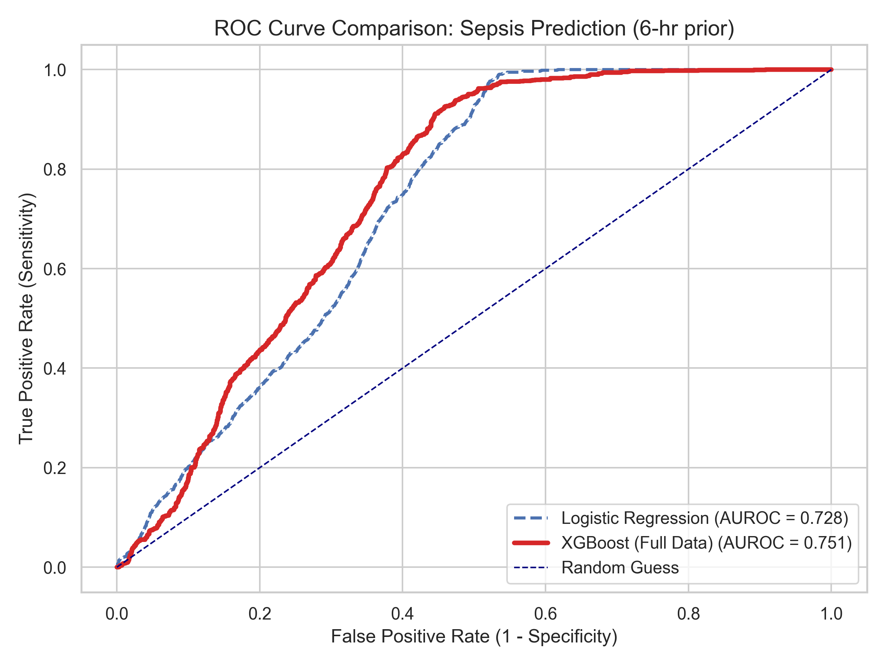
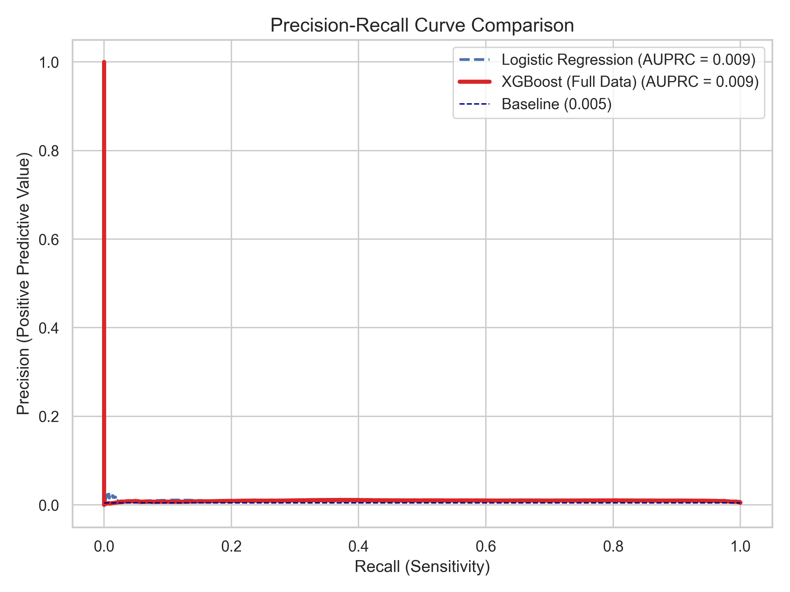
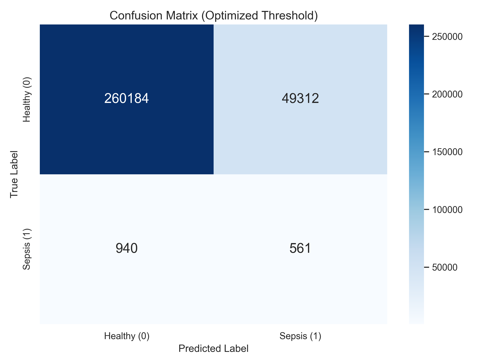
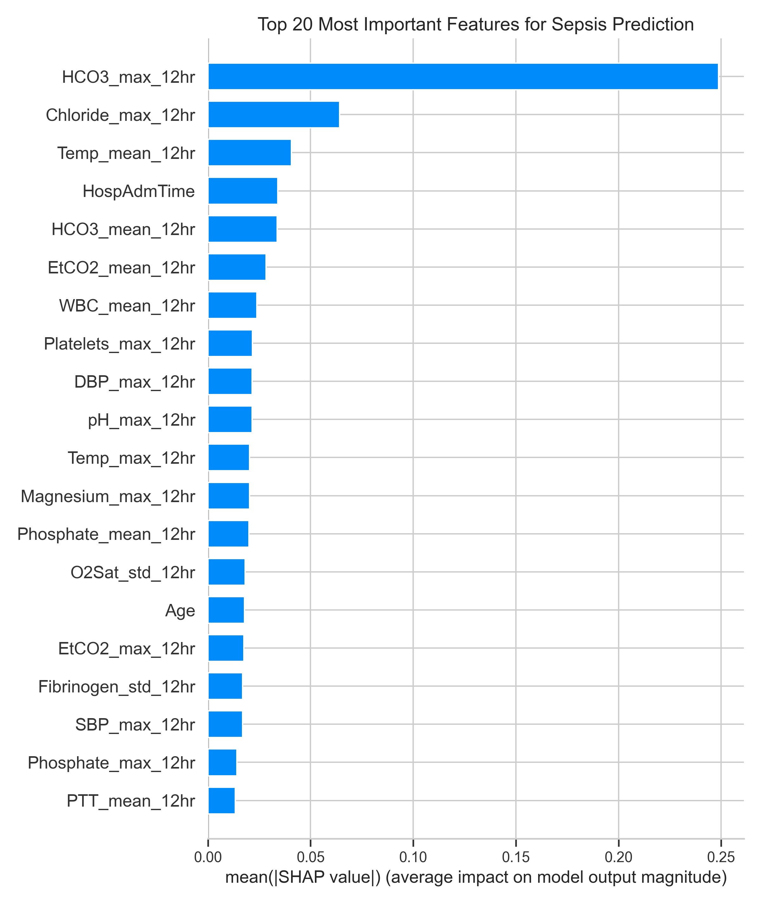

# Sepsis Early Warning System

> A capstone project to build a machine learning model that predicts the onset of sepsis 6 hours in advance using real-world ICU time-series data.

This project follows a complete data science pipeline:
1.  **Data Processing:** Cleaning and imputing over 1.2 million patient-hours of data.
2.  **Feature Engineering:** Creating 100+ "lookback" features to capture patient trends.
3.  **Model Training:** Tuning and comparing Logistic Regression and XGBoost models.
4.  **Evaluation:** Analyzing model performance using AUROC, AUPRC, and a confusion matrix.
5.  **Interpretability:** Using SHAP to understand *why* the model makes its predictions.

---

##  The Data

* **Source:** A large, public-access ICU dataset containing records from over 40,000 patients.
* **Size:** **1.24+ million** total patient-hours of observations.
* **Features:** 40 raw vital signs and lab values (e.g., HR, Temp, Lactate, WBC).
* **Key Challenges:**
    1.  **Massive Missing Data:** The data is extremely sparse, requiring robust imputation.
    2.  **Extreme Class Imbalance:** The "sepsis" event is incredibly rare.

---

## Project Pipeline

1.  **Data Preprocessing:**
    * All 40,000+ individual patient `.psv` files were loaded and combined.
    * Missing data (`NaN`s) was filled using **forward-fill (`ffill`)**. This assumes a patient's last-known vital sign is stable until a new one is taken.
    * A **patient-level split** (80% train, 20% test) was performed. This is critical to prevent data leakage and ensure the model is evaluated on patients it has never seen before.

2.  **Feature Engineering (The Sliding Window):**
    * **Lookahead (Target `y`):** The primary project goal. A new target label, `SepsisLabel_6hr_lookahead`, was created. This label is `1` if a patient becomes septic within the *next* 6 hours, teaching the model to predict *in advance*.
    * **Lookback (Features `X`):** A model needs trends, not snapshots. 107 new features were built by calculating 12-hour rolling statistics (mean, max, std) for all 34 vitals and labs (e.g., `HR_mean_12hr`, `Lactate_max_12hr`).

3.  **Model Training & Tuning:**
    * A **Logistic Regression** model was trained as a simple baseline.
    * An **XGBoost** model was trained as the primary, high-performance challenger.
    * A "sample-then-retrain" strategy was used due to computational limits. `RandomizedSearchCV` was run on a 250,000-row sample to find the best hyperparameters.
    * The winning XGBoost parameters were then used to re-train the final model on the **entire 1.24 million-row dataset**.

---

## 📈 Results & Key Findings

### Finding 1: The "Needle-in-a-Haystack" Problem

This project's biggest challenge isn't the model; it's the data.
* An analysis of the test set revealed that the 6-hour warning label is positive in only **0.48%** of cases.
* This means for every 1 true sepsis case, there are over 200 healthy cases.
* This extreme class imbalance makes "accuracy" a useless metric and requires focusing on AUROC and AUPRC.

### Finding 2: Final Model Performance

The final XGBoost model (trained on all 1.2M+ rows) was the clear winner.

| Model | AUROC | AUPRC | Baseline AUPRC |
| :--- | :--- | :--- | :--- |
| Logistic Regression | 0.728 | 0.0092 | 0.0048 |
| **XGBoost (Final)** | **0.751** | **0.0094** | 0.0048 |

**Key Takeaway:** The XGBoost model achieved a strong **AUROC of 0.751**. More importantly, its AUPRC of **0.0094** is **nearly double the random baseline (0.0048)**, proving it successfully found a real, predictive signal in the noisy, imbalanced data.

| ROC Curve (Ranking Power) | Precision-Recall Curve (Finding Rare Cases) |
| :---: | :---: |
|  |  |

### Finding 3: The Real-World Trade-Off

This confusion matrix shows the model's performance at its optimal F1-score threshold:

* **True Positives: 561** (Sepsis cases correctly found 6 hours early)
* **False Negatives: 940** (Sepsis cases missed)
* **False Positives: 49,312** (False alarms)

This gives a **Recall of 37.4%** (finding over a third of all cases) but a **Precision of only 1.1%** (due to the 49k false alarms). This highlights the "needle-in-a-haystack" challenge.

### Finding 4: Model Interpretability (SHAP)

The model is not a "black box." A SHAP analysis shows *why* it makes its predictions.

The #1 most important feature is **`HCO3_max_12hr`** (Bicarbonate), followed by **`Chloride_max_12hr`**. This is a powerful clinical insight. The model independently learned that **metabolic acidosis** (which is what these lab values indicate) is the single biggest predictor of sepsis.

---

## 🧪 Additional Experiments (What Didn't Work)

To confirm the winning model, I ran two experiments to try and fix the low AUPRC score. **Both failed**, proving that my original approach was the most robust.

1.  **Undersampling (3:1 ratio):** I threw away most of the "healthy" data.
    * *Result:* AUPRC dropped from 0.0094 to **0.0084**. The model lost crucial context.

2.  **SHAP Feature Selection + SMOTE (Oversampling):** I used only the Top 20 features and created synthetic "sepsis" data.
    * *Result:* AUPRC dropped from 0.0094 to **0.0093**. The synthetic data blurred the decision boundary.

**Conclusion:** The best model is the one trained on **all 107 features** and all **1.2 million data points**.

---

## 💡 Limitations & Future Work

* **Computational Limits:** The 1.2M+ row dataset is extremely memory-intensive. `RandomizedSearchCV` would hang with `n_jobs > 1`, forcing a "sample-then-retrain" strategy. This also made **LSTMs** (a more complex time-series model) unfeasible, as they are even more computationally taxing.
* **Data Limits:** The **0.48% positive rate** is the single biggest hurdle to achieving a high AUPRC score. The model would be dramatically better if trained on a dataset with more positive examples.
* **Future Work:**
    1.  With access to high-RAM, GPU-based cloud computing, I would implement a full-scale LSTM.
    2.  I would engineer "slope" features to measure the *rate of change* of vitals, not just the 12-hour average.

---
